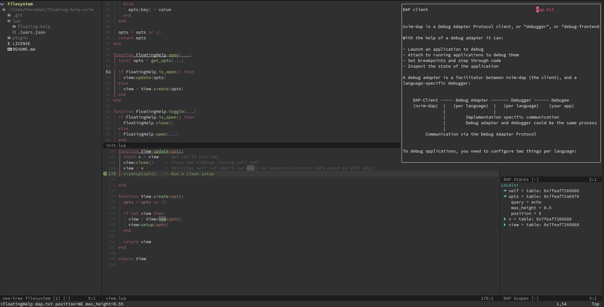
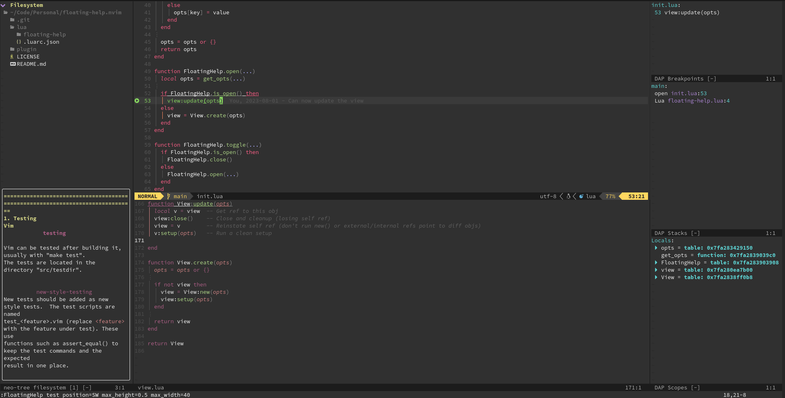

# 📚 FloatingHelp

<p align="center">A Neovim plugin to show <code>:help</code>, <a href="https://github.com/aitjcize/cppman">cppman</a>, or <code>man</code> in an anchorable/resizable floating window.</p>


`:FloatingHelp dap.txt position=NE height=0.55`


`:FloatingHelp test position=SW height=0.5 width=40`

## ⚒️ Installation

Install with your preferred plugin manager:

```lua
-- packer.nvim
use 'Tyler-Barham/floating-help.nvim'
```

Optionally, install [cppman](https://github.com/aitjcize/cppman)

## ⚙️ Configuration

### Setup

You need to call the `setup()` method to initialize the plugin

```lua
local fh = require('floating-help')

fh.setup({
  -- Defaults
  width = 80,   -- Whole numbers are columns/rows
  height = 0.9, -- Decimals are a percentage of the editor
  position = 'E',   -- NW,N,NW,W,C,E,SW,S,SE (C==center)
  border = 'rounded', -- rounded,double,single
  onload = function(query_type) end, -- optional callback to be executed after help contents has been loaded
})

-- Create a keymap for toggling the help window
vim.keymap.set('n', '<F1>', fh.toggle)
-- Create a keymap to search cppman for the word under the cursor
vim.keymap.set('n', '<F2>', function()
  fh.open('t=cppman', vim.fn.expand('<cword>'))
end)
-- Create a keymap to search man for the word under the cursor
vim.keymap.set('n', '<F3>', function()
  fh.open('t=man', vim.fn.expand('<cword>'))
end)

-- Only replace cmds, not search; only replace the first instance
local function cmd_abbrev(abbrev, expansion)
  local cmd = 'cabbr ' .. abbrev .. ' <c-r>=(getcmdpos() == 1 && getcmdtype() == ":" ? "' .. expansion .. '" : "' .. abbrev .. '")<CR>'
  vim.cmd(cmd)
end

-- Redirect `:h` to `:FloatingHelp`
cmd_abbrev('h',         'FloatingHelp')
cmd_abbrev('help',      'FloatingHelp')
cmd_abbrev('helpc',     'FloatingHelpClose')
cmd_abbrev('helpclose', 'FloatingHelpClose')
```

## 🚀 Usage

### Commands

- `FloatingHelp <args>`
- `FloatingHelpToggle <args>`
- `FloatingHelpClose`

Args (none are positional):

- `<str>` The help page to show
- `p[osition]=<N,S,E,W>`
- `h[eight]=<number>`
- `w[idth]=<number>`
- `t[ype]=<help|cppman|man>`

### API

```lua
local fh = require('floating-help')

fh.open({args})
fh.toggle({args})
fh.close()
```

## 🤝 Contributing

All contributions are welcome! Just open a pull request.
