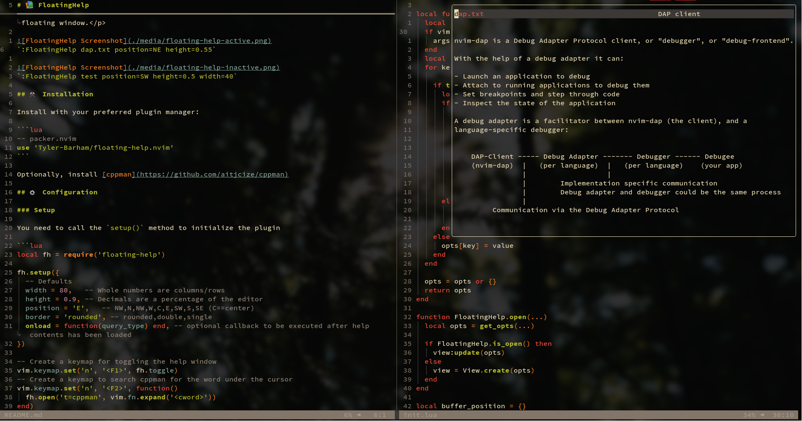

# 📚 FloatingHelp

<p align="center">A Neovim plugin to show `:help` in an anchorable/resizable floating window.</p>


`:FloatingHelp dap.txt position=NE max_height=0.55`


`:FloatingHelp test position=SW max_height=0.5 max_width=40`

## ⚒️ Installation

Install with your preferred plugin manager:

```lua
-- packer.nvim
use 'Tyler-Barham/floating-help.nvim'
```

## ⚙️ Configuration

### Setup

You need to call the `setup()` method to initialize the plugin

```lua
local fh = require('floating-help')

fh.setup({
  -- Defaults
  max_width = 80,   -- Whole numbers are columns/rows
  max_height = 0.9, -- Decimals are a percentage of the editor
  position = 'E',   -- NW,N,NW,W,C,E,SW,S,SE (C==center)
})

-- Create a keymap for toggling the help window
vim.keymap.set('n', '<F1>', fh.toggle)

-- Redirect `:h` to `:FloatingHelp`
vim.cmd([[cabbrev h FloatingHelp]])
vim.cmd([[cabbrev help FloatingHelp]])
```

## 🚀 Usage

### Commands

- `FloatingHelp <args>`
- `FloatingHelpToggle <args>`
- `FloatingHelpClose`

Args (none are positional):

- `<str>`: Help page
- `position=<str>`
- `max_height=<number>`
- `max_width=<number>`

### API

```lua
local fh = require('floating-help')

fh.open({args})
fh.toggle({args})
fh.close()
```

## 🤝 Contributing

All contributions are welcome! Just open a pull request.
